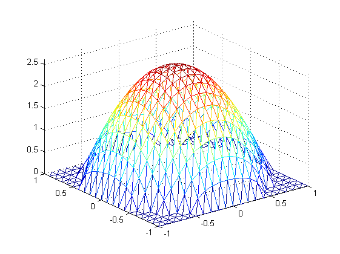

# 微分方程数值解作业三

|姓名|学号|
|---|---|
|15336134|莫凡|

### 任务要求

用线性元求解Poisson方程的第一边值问题，分别使用矩形剖分和三角剖分

$$ -\Delta u=f(x,y)\quad u|_\tau=0 $$

简单起见，我们设 $$f(x,y)=4$$

照例，程序可以解决其他的$ f(x,y)$

### 理论分析

其实矩形元多切一刀就是三角形元。所以我们只需要处理了三角形元时的刚度矩阵就可以轻易推广到矩形元

线性元插值函数是$$\varphi_i=L_i=\frac{1}{2S_{\mu}}(a_i+b_ix+c_iy)$$

其中$a_i=x_jy_k-x_ky_j,~b_i=y_i-y_k,~c_i=x_k-x_j$

有限元方程就是

$$\sum_{i=1}^{n_1}\alpha(\varphi_i,\varphi_j)u_i=(f,\varphi_j)-\sum_{i=n_1+1}^{n_1+n_2}\alpha(\varphi_i,\varphi_j)\alpha_i$$

接下来就是按照定义积分。不如直接拿软件算。结果还特别特别的长，不是非常想抄（前两次都是一大页感觉不太好），互相浪费时间。如果您觉得有必要我再补上哈

困难的地方在于剖分的方法。矩形不用说，直接等距离划分即可。三角形时我采用了MIT的 [这篇论文(A simple mesh generator in MATLAB)](http://202.116.81.74/cache/3/03/persson.berkeley.edu/ed15b3bdc8623cbf18b8a655b4dfd5f2/persson04mesh.pdf)中提到的，一种按照与新边界距离寻找新的内部点的算法

### 代码说明

- poisson.m 是主程序，里面主要是输入$f$以及划分好的三角形区域，列出刚度矩阵然后求解方程并画出图像

- distmesh2d.m 是参考上述论文的方法，对平面进行三角剖分，返回剖分好的点和每个小三角形对应的坐标

- recmesh2d.m 是矩形剖分方法，然后将每个矩形切成两个三角形，按照上述格式返回给Poisson函数

- script.m 调用poisson函数

### 实验结果

三角形剖分画出来的图是这个样子

然后对应地，三角形剖分得到的结果是这个样子

换成矩形剖分，结果就变成了

因为实际上都是三角，感觉不出来什么区别