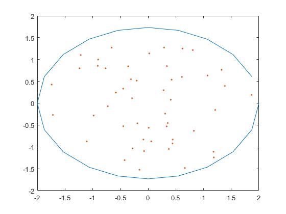
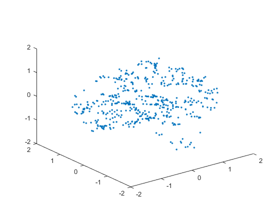

# 微分方程实验报告
15336134 莫凡

### 问题描述
使用有限体积法求解Poisson方程的第一边值问题\[-\Delta u=f\] 特化问题，我们令$f(x,y)=x+y$

### 算法概述
先将区域$\Gamma$用一个内接多边形近似，然后在多边形内任取若干个点，按照这些点进行三角剖分。

对于每一个内点，顺次连接它相邻的三角形的重心，得到一个对偶区域，在这个区域上对$f$进行积分。

同时，对于每一个内点$P$，定义一个分片线性的插值基函数$\varphi_P$，使得对于每个三角形$ABP$，均有$\varphi_P(P)=1,~\varphi_P(A)=0,~\varphi_P(B)=0$。只需要解若干个三元线性方程组即可得到$\varphi$

$\varphi$的系数$u$通过求解如下线性方程组得出
\[\sum_{i}\dfrac{1}{4S_{q_i}}[(u_{p_i} - u_{p_0})\overrightarrow{p_{i+1}p_0}\cdot\overrightarrow{p_ip_{i+1}}+(u_{p_{i+1}}-u_{p_0})\overrightarrow{p_{0}p_{i}}\cdot\overrightarrow{p_ip_{i+1}}]=(f,\psi_{p_0})\]

其中$\psi$是对偶区域的特征函数，表示一个点是否在该区域内。

### 实验步骤
首先将椭圆按照圆心角等分，然后再在椭圆内随机取若干个点，得到

接着使用软件进行三角剖分

积算出来的散点图如下

除了个别的点，其他点的位置都和结果差不多

### 代码清单
- tri 三角剖分软件
- area.m 计算三角形面积
- checkIn.m 检查一个点是否在某一三角形内部
- data.m 数据生成和预处理
- getPhi.m 生成 $\varphi$ 函数
- solve.m 求解主程序
- 